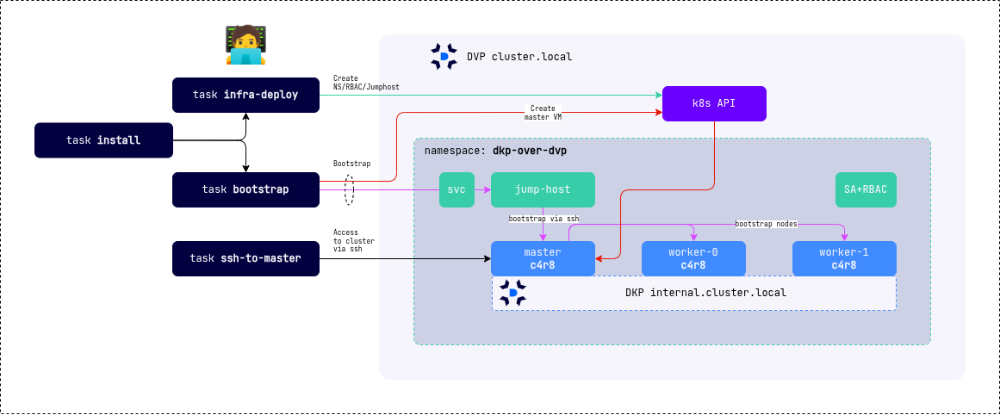

# DKP Cluster Deployment on DVP

This repository provides an example of deploying a [DKP](https://deckhouse.io/products/kubernetes-platform/) cluster on the [DVP](https://deckhouse.io/products/virtualization-platform/) platform using the [`dvp-cloud-provider`](https://deckhouse.io/products/kubernetes-platform/documentation/v1.71/modules/cloud-provider-dvp/) module. The example is intended for demonstration purposes only and is not recommended for production use due to preconfigured secrets (SSH keys and passwords).

## Overview

The repository includes a `Taskfile` to simplify environment setup and DKP cluster deployment on DVP. The setup process creates:

- A namespace.
- A ServiceAccount with required permissions.
- An Ubuntu 24.04 image for cluster nodes.
- A [jump-host](https://github.com/fl64/jumphost) for external access to cluster nodes during bootstrap.

After environment setup, the cluster is bootstrapped using the [dhctl](https://deckhouse.io/products/kubernetes-platform/documentation/v1/installing/) utility.



## Requirements

The setup has been tested on Linux. The following tools are required:

- `yq`
- `jq`
- `htpasswd`
- `kubectl`
- `task`

To verify that all required components are installed, run:

```bash
task default
```

## Usage

Copy and configure the `config.yaml` file from the example:

```bash
cp config.example.yaml config.yaml
```

Before starting the deployment, edit `config.yaml` to include necessary changes, at a minimum specifying the `StorageClass` for node root disks.

Deploy the environment (namespace, RBAC, etc.):

```bash
 task infra-deploy
```

Bootstrap the cluster:

```bash
task bootstrap
```

To perform all deployment steps in one command:

```bash
task install
```

To access the cluster's master node:

```bash
task ssh-to-master
```

To remove all created resources:

```bash
task infra-undeploy && task clean
```
